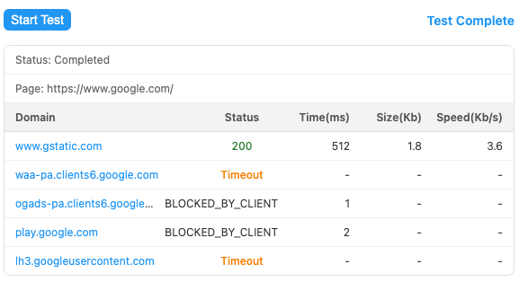

# Proxy Domain Tester

[English Documentation](README_EN.md)

这是一个 Chrome 浏览器扩展，旨在帮助开发者和网络管理员测试当前网页所依赖的第三方域名（如 CDN、API、统计代码等）在特定代理策略下的连通性与加载性能。

## 功能

开始测试后，扩展会在后台新建一个标签页访问当前页面，并按照“当前页面的域名使用代理访问，页面中的其他域名使用直连访问”的策略发起网络请求。在一定的时间后，收集请求数据，关闭后台标签。

如下图结果显示，在访问`https://www.google.com`页面时，`www.gstatic.com`域名可以通过直连的方式正常访问。

## 安装

由于该扩展尚未发布到 Chrome Web Store，您需要通过"加载已解压的扩展程序"方式安装：

1. **下载代码**：克隆或下载本仓库代码到本地。
2. **打开扩展管理页**：在 Chrome 地址栏输入 `chrome://extensions/` 并回车。
3. **开启开发者模式**：点击页面右上角的"开发者模式"开关。
4. **加载扩展**：点击左上角的"加载已解压的扩展程序"按钮，选择本项目的根目录。
5. **完成**：浏览器工具栏出现扩展图标即表示安装成功。

## 使用

### 1. 配置代理（首次使用必做）
在开始测试前，您需要告诉扩展使用哪个代理服务器来访问主页面：
- 在扩展图标上 **右键单击**，选择 **选项**。
- 在 **"代理地址"** 输入框中填写您的代理服务器地址（例如 `127.0.0.1:7890`）。
- 根据需要调整超时时间等参数，设置会自动保存。

### 2. 开始测试
1. 在浏览器中打开您想要测试的目标网页。
2. 点击地址栏右边的扩展图标。
3. 点击 **开始测试** 按钮。
4. 等待测试完成。

### 3. 停止测试
测试过程中点击 **停止测试** 按钮可随时中止测试，已获取的结果会被保留。

## 设置

进入 **选项** 页面可进行详细配置：

- **代理地址**:
    - 必填。格式为 `IP:端口` 或 `域名:端口`。
- **请求超时时长**:
    - 页面加载的最长等待时间（默认建议 5000ms）。
- **测试采集时长**:
    - 页面加载完成后，继续等待收集后续资源请求的时间窗口。
- **禁用缓存**:
    - 勾选后尝试禁用测试页面请求的缓存。

## 注意事项
- 测试期间，浏览器的代理设置会被临时接管。测试结束后，会自动恢复为默认设置。
- 由于页面加载的复杂性，收集到的域名数量可能少于在开发者工具中直接可见的域名数量。